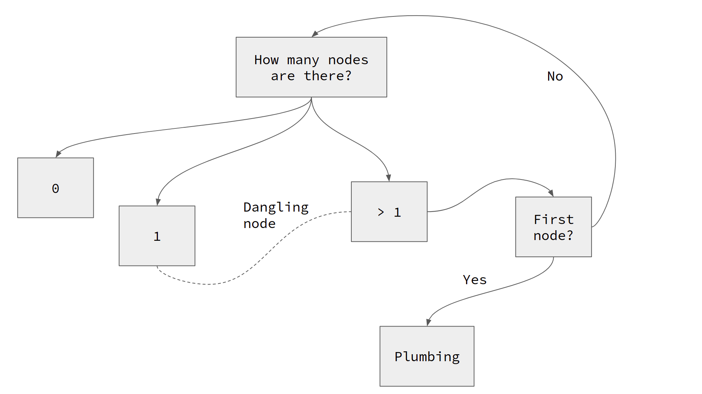

# Linked List

## N1: Deleting a node

A recursive method to delete a node from a linked list has three questions:

- How many nodes does the list have?

- Is the node to be deleted the first node?
- Is the node to be deleted the last node?

The flowchart given below encodes the relationship among these questions.

