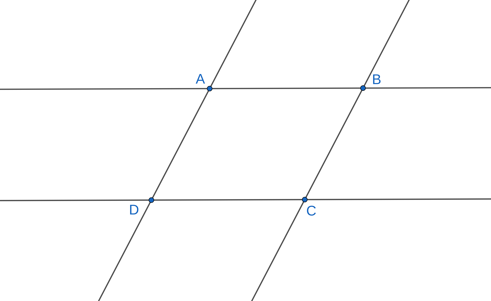

# Introduction

## Head of the Family

Parallel lines are the stuff parallelograms are made of. To produce a bounded shape we need at least three lines. A triangle is the simplest such shape. If we want to get a bounded shape but using parallel lines, then we need at least four lines. Thus a parallelogram is a four-sided shape formed when two pairs of parallel lines intersect each other.

Criss-crossing rail tracks form a parallelogram. The next time you go in a train, remember that at some point you would be moving over a parallelogram. The beauty of this shape is that its definition becomes obvious once we specify two requirements:

 - parallel lines
 - bounded shape

Another way of saying this is that a parallelogram is the most efficient way of creating bounded shapes with parallel lines: remove one line and there is no bounded shape to talk about.  Parallelograms have a number of properties that make them delightful objects to study. Let us probe further. If we wish to do something useful with parallel lines, we need a transversal. That unlocks relations between angles that might be handy later. So let us first connect any pair of opposite vertices, say $B$ and $D$, called a diagonal of the parallelogram. This has the nice property of being a transveral for both pairs of parallel sides.

We make the following immediate observations:

- The diagonal divides the parallelogram into two triangles: $\bigtriangleup ABD$ and $\bigtriangleup CDB$
- $\angle ABD = \angle CDB$ (as $AB$ \|\| $CD$ cut by $BD$)
- $\angle ADB = \angle CBD$ (as $AD$ \|\| $BC$ cut by $BD$)

The two triangles have two angles that are equal. We smell congruence here. Do we have an included side? Yes! $BD$ is the common side. So triangles $\bigtriangleup ABD$ and $\bigtriangleup CDB$ are congruent by the $ASA$ criterion. We can deduce the following results using the congruence:

- $AB = CD$ and $AD = BC$
- $\angle BAD = \angle BCD$

How do these symbols translate to words?

In a parallelogram

- opposite sides are equal
- opposite angles are equal

 A great quality of a parallelogram is that its properties are also equivalent ways of specifying the same object. The following are at once properties and definitions of a parallelogram:

 - opposite sides parallel to each other (primary definition)
 - opposite sides equal to each other
 - a pair of opposite sides parallel and equal to each other
 - diagonals bisect each other

## Properties of other members

We now specify the properties of few other members.

- Rectangle
  - The diagonals are equal
  - The diagonals intersect at right angles *iff* the rectangle is a square. For a strict rectangle, the diagonals cannot intersect at right angles.
- Rhombus
  - The diagonals bisect each other at right angles
- Square
  - The diagonals are equal and bisect each other at right angles

## Symmetries

- Central symmetry 
  - The point of intersection of diagonals is a center of symmetry. Rotating the parallelogram $180^{\circ}$ about this point will result in the same figure.
- Axial symmetry
  - A rectangle has two axes of symmetry given by perpendicular bisectors of the sides
  - A rhombus also has two axes of symmetry given by the diagonals
  - A square has four axes of symmetry

## Inheritance

There are certain relationships among the different members of the parallelogram family. We club them under the term "inheritance". The head of the family is the parallelogram itself. 

- A rectangle is a parallelogram.
- A rhombus is a parallelogram.
- A square is a parallelogram, a rectangle and a rhombus.

## The parallelogram family

The members of the family are arranged in the order of increasing constraints or decreasing information.

| Object        | Constraint                                                   | Information           | Degrees of freedom | Symmetries                  |
| ------------- | ------------------------------------------------------------ | --------------------- | ------------------ | --------------------------- |
| Parallelogram | opposite sides parallel                                      | side side angle | 3                  | Central                     |
| Rectangle     | opposite sides parallel adjacent sides perpendicular      | side side          | 2                  | Central  Axial           |
| Rhombus       | opposite sides parallel adjacent sides equal              | side angle         | 2                  | Central  Axial           |
| Square        | opposite sides parallel adjacent sides equal adjacent sides perpendicular | side                  | 1                  | Central  Axial  Axial |

## The Philosophical Parallelogram

- The most information hungry object is the freest.
- If you want freedom then be prepared to work hard to achieve it. If you need freedom you need to work for it.
- Freedom is a great privilege that you need to earn.
- We seek squares because they require least effort to specify exactly. But look how constrained it is. It is easy to build a square, but being one is tough.
- A square symbolizes conformity. Be a parallelogram, constantly strive for freedom and diversity.
- Oh stifled squares, be plastic parallelograms. Better yet, become queer quadrilaterals if that be your maker's order.
- If you are born to be a quadrilateral of a given shape, will not being a square be suffocating. Let us have nothing to do with conformity.
- God created a curved space-time, man turned it flat with his Cartesian conventions, until his messenger made it curved once more.
- The parallelogram is a typical example of restrained freedom.
- The number of letters also reflect the freedom enjoyed by these shapes.

